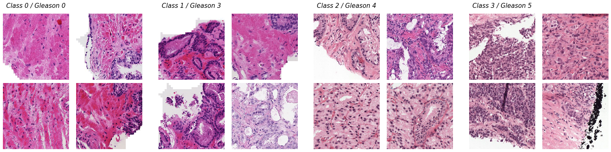
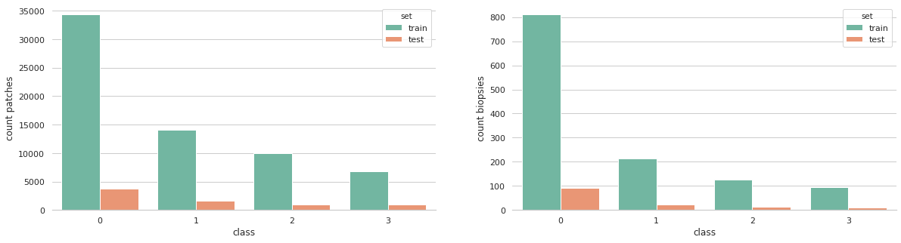
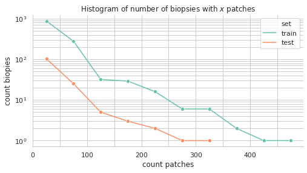

# Prostate Gleason Dataset

---

*Prostate Gleason Dataset* is an image database of prostate cancer biopsies derived from the [PANDA dataset](https://www.kaggle.com/c/prostate-cancer-grade-assessment/overview). The database consists of about **70K patches** of size **256x256 pixels** extracted from the PANDA's biopsies *with overlap*. The patches are grouped in **4 classes** depending on their [Gleason grade](https://en.wikipedia.org/wiki/Gleason_grading_system):

* **Class 0**: Stroma + Gleason 0 
* **Class 1**: Gleason 3 
* **Class 2**: Gleason 4 
* **Class 3**: Gleason 5 

resulting in the following dataset distributions:

My hope is to help improving ML-based prostate-cancer assessment by providing a novel patch labelled dataset. 

Current computational pathology is usually based on labels of whole slide images of biopsies where the labels are ISUP grades or Gleason composite scores. These labels tend to be noisy and non-informative at the cellular/glandular level, for they provide information derived from large, non-contigous and non-omogeneous (w.r.t. the cellular/glandular visual properties of the cancer) areas of the biopsies. 

Tipically, modelling this data for predicting the ISUP grade/Gleason score involves 2 steps: 

1. finding a relationship between the given whole-slide label and the visual properties of the cancer at the cellular/glandular level; 
2. tranforming this low-level properties back into a whole-slide prediction. 
 
The *Prostate Gleason Dataset* brings mainly 2 contributions:

1. aims to easy the computational burden on step 1) by providing finer grained labels;
2. provides information that can be used for transfer learning to other computational pathology problems.

## Parent Dataset Overview

---

10616 whole-slide images of H&E-stained biopsies. The images where collected from different scanners at the Radboud University Medical Center and Karolinska Institute. The former institution used a 3DHistech Pannoramic Flash II 250 scanner at 20x magnification and stored the final image at a pixel resolution of 0.48μm. The later used a Hamamatsu C9600-12 scanner and a Aperio ScanScope AT2 scanner, obtaining a pixel resolution of 0.45202μm and 0.5032μm respectively. The smallest image in the dataset has an area of 2304x4352 pixels and the largest is 55296x73728 pixels.

Part of the images were obtained from slices of the same biopsy and therefore they belong to the same patient.

All images were labelled with both an ISUP grade and Gleason score (primary pattern + secondary pattern) accordingly to the **ISUP 2014 guidelines**. 

Furthermore, the biopsies comes with a ML-predicted mask bringing (relatively noisy) information on background vs stroma vs epithelium pixels.

## Derivation Process

---

The parent dataset is filtered by Gleason score and just images with **equal primary and secondary patterns** are kept (Gleason 0+0, 3+3, 4+4 and 5+5). This aims to ensure the final patches don't contain non-omogeneous Gleason grades. The remaining images are divided into 512x512 pixels overlapping patches (stride 256 pixels). Then, 2 different filtering processes were used depending on wether the biopsy's Gleason score was equal to 0+0 or greater:

* *Gleason 0+0*: two different classes A and B are produced:
  - for class A a patch is kept if the number of stroma pixels is >=75% of the area of the patch, accordingly with the mask;
  - for class B a patch is kept if the number of Gleason 0 pixels is >=75% of the area of the patch, accordingly with the mask;
  - the two subsets are merged to produce **class 0**
  
* *Gleason 3+3, 4+4, or 5+5*: a patch is kept if the number of Gleason X pixels is >=75% of the area of the patch, accordingly with the mask; **classes 1, 2 and 3** are produced for Gleason grades 3, 4 and 5 respectively.

In order to remove noisy entries, all the remaining patches went through a manual labelling step and they were finally resized to 256x256 pixels using nearest neighboor interpolation. It follows that the final pixel resolution is in the range from **0.90404μm** to **1.0064μm**, depending on the scanner used. Arguably, this pixel resolution and the selected patch size provide the best compromise between the resolution at the cellular/glandular level, the goodness of the contextual information in the visual field and the dataset size.

## Models

---

| Model                                               | Accuracy | Training Time x Epoch (s) |
|:----------------------------------------------------|---------:|--------------------------:|
| [ResNeXt 50 32x4d](./models/resnext-50-32x4d.pth)   |    87.4% |                       251 |
| [ResNeXt 101 32x8d](./models/resnext-101-32x8d.pth) |    87.4% |                       619 |
| [EfficientNet B0](./models/efficientnet-b0.pth)     |    87.4% |                       244 |
| [EfficientNet B1](./models/efficientnet-b1.pth)     |    87.7% |                       315 |
| [EfficientNet B2](./models/efficientnet-b2.pth)     |    88.2% |                       329 |

## Limitations and Future Work

---

